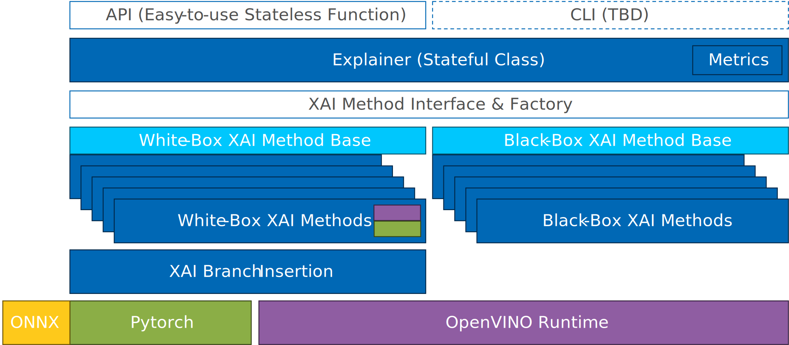
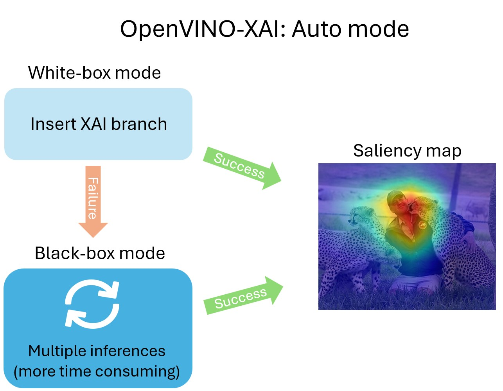

# OpenVINO™ Explainable AI Toolkit User Guide

**OpenVINO™ Explainable AI (XAI) Toolkit** provides a suite of XAI algorithms for visual explanation of OpenVINO™ Intermediate Representation (IR) models.
Model explanation helps to identify the parts of the input that are responsible for the model's prediction,
which is useful for analyzing model's performance.

Current tutorial is primarily for classification CNNs.

OpenVINO XAI API documentation can be found [here](https://openvinotoolkit.github.io/openvino_xai/).

Content:

- [OpenVINO™ Explainable AI Toolkit User Guide](#openvino-explainable-ai-toolkit-user-guide)
  - [OpenVINO XAI Architecture](#openvino-xai-architecture)
  - [`Explainer`: the main interface to XAI algorithms](#explainer-the-main-interface-to-xai-algorithms)
    - [Create Explainer for OpenVINO Model instance](#create-explainer-for-openvino-model-instance)
    - [Create Explainer from OpenVINO IR file](#create-explainer-from-openvino-ir-file)
    - [Create Explainer from ONNX model file](#create-explainer-from-onnx-model-file)
  - [Basic usage: Auto mode](#basic-usage-auto-mode)
    - [Running without `preprocess_fn`](#running-without-preprocess_fn)
    - [Specifying `preprocess_fn`](#specifying-preprocess_fn)
  - [White-Box mode](#white-box-mode)
  - [Black-Box mode](#black-box-mode)
  - [XAI insertion (white-box usage)](#xai-insertion-white-box-usage)
  - [Saving saliency maps](#saving-saliency-maps)
  - [Example scripts](#example-scripts)


## OpenVINO XAI Architecture



OpenVINO XAI provides the API to explain models, using two types of methods:

- **White-box** - treats the model as a white box, making inner modifications and adding an extra XAI branch. This results in additional output from the model and relatively fast explanations.
- **Black-box** - treats the model as a black box, working on a wide range of models. However, it requires many more inference runs.

## `Explainer`: the main interface to XAI algorithms

In a nutshell, the explanation call looks like this:

```python
import openvino_xai as xai

explainer = xai.Explainer(model=model, task=xai.Task.CLASSIFICATION)
explanation = explainer(data)
```

There are a few options for the model formats. The major use-case is to load OpenVINO IR model from file and pass `ov.Model` instance to explainer.

### Create Explainer for OpenVINO Model instance

```python
import openvino as ov
model = ov.Core().read_model("model.xml")

explainer = xai.Explainer(
    model=model,
    task=xai.Task.CLASSIFICATION
)
```

### Create Explainer from OpenVINO IR file

The Explainer also supports the OpenVINO IR (Intermediate Representation) file format (.xml) directly like follows:

```python
explainer = xai.Explainer(
    model="model.xml",
    task=xai.Task.CLASSIFICATION
)
```

### Create Explainer from ONNX model file

[ONNX](https://onnx.ai/) is an open format built to represent machine learning models.
The OpenVINO Runtime supports loading and inference of the ONNX models, and so does OpenVINO XAI.

```python
explainer = xai.Explainer(
    model="model.onnx",
    task=xai.Task.CLASSIFICATION
)
```

## Basic usage: Auto mode

The easiest way to run the explainer is in Auto mode. Under the hood, Auto mode will try to run in `White-Box` mode first. If it fails, it will run in `Black-Box` mode.

Learn more details about [White-Box](#white-box-mode) and [Black-Box](#black-box-mode) modes below.



Generating saliency maps involves model inference. Explainer will perform model inference but to do it, it requires `preprocess_fn` and `postprocess_fn`.

### Running without `preprocess_fn`

Here's the example how we can avoid passing `preprocess_fn` by preprocessing data beforehand (like resizing and adding a batch dimension).

```python
import cv2
import numpy as np
from typing import Mapping
import openvino.runtime as ov

import openvino_xai as xai


def postprocess_fn(x: Mapping):
    # Implementing our own post-process function based on the model's implementation
    # Return "logits" model output
    return x["logits"]

# Create ov.Model
model = ov.Core().read_model("path/to/model.xml")  # type: ov.Model

# Explainer object will prepare and load the model once in the beginning
explainer = xai.Explainer(
    model,
    task=xai.Task.CLASSIFICATION,
    postprocess_fn=postprocess_fn,
)

# Generate and process saliency maps (as many as required, sequentially)
image = cv2.imread("path/to/image.jpg")

# Pre-process the image as the model requires (resizing and adding a batch dimension)
preprocessed_image = cv2.resize(src=image, dsize=(224, 224))
preprocessed_image = np.expand_dims(preprocessed_image, 0)

# Run explanation
explanation = explainer(
    preprocessed_image,
    target_explain_labels=[11, 14],  # indices or string labels to explain
    overlay=True,  # False by default
    original_input_image=image,  # to apply overlay on the original image instead of the preprocessed one that was used for the explainer
)

# Save saliency maps
explanation.save("output_path", "name_")
```

### Specifying `preprocess_fn`


```python
import cv2
import numpy as np
from typing import Mapping
import openvino.runtime as ov

import openvino_xai as xai


def preprocess_fn(x: np.ndarray) -> np.ndarray:
    # Implementing our own pre-process function based on the model's implementation
    x = cv2.resize(src=x, dsize=(224, 224))
    x = np.expand_dims(x, 0)
    return x

def postprocess_fn(x: Mapping):
    # Implementing our own post-process function based on the model's implementation
    # Return "logits" model output
    return x["logits"]

# Create ov.Model
model = ov.Core().read_model("path/to/model.xml")  # type: ov.Model

# The Explainer object will prepare and load the model once in the beginning
explainer = xai.Explainer(
    model,
    task=xai.Task.CLASSIFICATION,
    preprocess_fn=preprocess_fn,
    postprocess_fn=postprocess_fn,
)

# Generate and process saliency maps (as many as required, sequentially)
image = cv2.imread("path/to/image.jpg")

# Run explanation
explanation = explainer(
    image,
    target_explain_labels=[11, 14],  # indices or string labels to explain
)

# Save saliency maps
explanation.save("output_path", "name_")
```


## White-Box mode

White-box mode involves two steps: updating the OV model and then running the updated model.

The updated model has an extra XAI branch resulting in an additional `saliency_map` output. This XAI branch creates saliency maps during the model's inference. The computational load from the XAI branch varies depending on the white-box algorithm, but it's usually quite small.

You need to pass either `preprocess_fn` or already preprocessed images to run the explainer in white-box mode.

```python
import cv2
import numpy as np
import openvino.runtime as ov

import openvino_xai as xai
from openvino_xai.explainer import ExplainMode


def preprocess_fn(x: np.ndarray) -> np.ndarray:
    # Implementing own pre-process function based on the model's implementation
    x = cv2.resize(src=x, dsize=(224, 224))
    x = np.expand_dims(x, 0)
    return x

# Create ov.Model
model = ov.Core().read_model("path/to/model.xml")  # type: ov.Model

# The Explainer object will prepare and load the model once at the beginning
explainer = xai.Explainer(
    model,
    task=xai.Task.CLASSIFICATION,
    preprocess_fn=preprocess_fn,
)

# Generate and process saliency maps (as many as required, sequentially)
image = cv2.imread("path/to/image.jpg")

voc_labels = [
    'aeroplane', 'bicycle', 'bird', 'boat', 'bottle', 'bus', 'car', 'cat', 'chair', 'cow', 'diningtable',
    'dog', 'horse', 'motorbike', 'person', 'pottedplant', 'sheep', 'sofa', 'train', 'tvmonitor'
]

# Run explanation
explanation = explainer(
    image,
    explain_mode=ExplainMode.WHITEBOX,
    # target_layer="last_conv_node_name",  # target_layer - node after which the XAI branch will be inserted, usually the last convolutional layer in the backbone
    embed_scaling=True,  # True by default. If set to True, the saliency map scale (0 ~ 255) operation is embedded in the model
    explain_method=xai.Method.RECIPROCAM,  # ReciproCAM is the default XAI method for CNNs
    label_names=voc_labels,
    target_explain_labels=[11, 14],  # target classes to explain, also ['dog', 'person'] is a valid input, since label_names are provided
    overlay=True,  # False by default
)

# Save saliency maps
explanation.save("output_path", "name_")
```


## Black-Box mode

Black-box mode does not update the model (treating the model as a black box).
Black-box approaches are based on the perturbation of the input data and measurement of the model's output change.

For black-box mode we support 2 algorithms: **AISE** (by default) and [**RISE**](https://arxiv.org/abs/1806.07421). AISE is more effective for generating saliency maps for a few specific classes. RISE - to generate maps for all classes at once.

Pros:
- **Flexible** - can be applied to any custom model.
Cons:
- **Computational overhead** - black-box requires hundreds or thousands of forward passes.

`preprocess_fn` (or preprocessed images) and `postprocess_fn` are required to be provided by the user for black-box mode.

```python
import cv2
import numpy as np
import openvino.runtime as ov

import openvino_xai as xai
from openvino_xai.explainer import ExplainMode


def preprocess_fn(x: np.ndarray) -> np.ndarray:
    # Implementing our own pre-process function based on the model's implementation
    x = cv2.resize(src=x, dsize=(224, 224))
    x = np.expand_dims(x, 0)
    return x

# Create ov.Model
model = ov.Core().read_model("path/to/model.xml")  # type: ov.Model

# The Explainer object will prepare and load the model once at the beginning
explainer = xai.Explainer(
    model,
    task=xai.Task.CLASSIFICATION,
    preprocess_fn=preprocess_fn,
)

# Generate and process saliency maps (as many as required, sequentially)
image = cv2.imread("path/to/image.jpg")

# Run explanation
explanation = explainer(
    image,
    explain_mode=ExplainMode.BLACKBOX,
    target_explain_labels=[11, 14],  # target classes to explain
    # target_explain_labels=-1,  # explain all classes
    overlay=True,  # False by default
)

# Save saliency maps
explanation.save("output_path", "name_")

```


## XAI insertion (white-box usage)

As mentioned above, saliency map generation requires model inference. In the above use cases, OpenVINO XAI performs model inference using provided processing functions. An alternative approach is to use XAI to insert the XAI branch into the model and infer it in the original pipeline.

`insert_xai()` API is used for insertion.

**Note**: The original model outputs are not affected, and the model should be inferable by the original inference pipeline.

```python
import openvino.runtime as ov
import openvino_xai as xai


# Create an ov.Model
model = ov.Core().read_model("path/to/model.xml")  # type: ov.Model

# Insert XAI branch into the model graph
model_xai = xai.insert_xai(
    model=model,
    task=xai.Task.CLASSIFICATION,
    # target_layer="last_conv_node_name",  # target_layer - the node after which the XAI branch will be inserted, usually the last convolutional layer in the backbone
    embed_scaling=True,  # True by default. If set to True, the saliency map scale (0 ~ 255) operation is embedded in the model
    explain_method=xai.Method.RECIPROCAM,  # ReciproCAM is the default XAI method for CNNs
)  # type: ov.Model

# ***** Downstream task: user's code that infers model_xai and picks 'saliency_map' output *****
```

## Saving saliency maps

You can easily save saliency maps with flexible naming options by using a `prefix` and `postfix`. The `prefix` allows saliency maps from the same image to have consistent naming.

The format for naming is:

`{prefix} + target_id + {postfix}.jpg`

Additionally, you can include the confidence score for each class in the saved saliency map's name.

`{prefix} + target_id + {postfix} + confidence.jpg`

```python
import cv2
import numpy as np
import openvino.runtime as ov
from typing import Mapping
import openvino_xai as xai

def preprocess_fn(image: np.ndarray) -> np.ndarray:
    """Preprocess the input image."""
    x = cv2.resize(src=image, dsize=(224, 224))
    x = x.transpose((2, 0, 1))
    processed_image = np.expand_dims(x, 0)
    return processed_image

def postprocess_fn(output: Mapping):
    """Postprocess the model output."""
    output = softmax(output)
    return output[0]

def softmax(x: np.ndarray) -> np.ndarray:
    """Compute softmax values of x."""
    e_x = np.exp(x - np.max(x))
    return e_x / e_x.sum()

# Generate and process saliency maps (as many as required, sequentially)
image = cv2.imread("path/to/image.jpg")

# Create ov.Model
MODEL_PATH = "path/to/model.xml"
model = ov.Core().read_model(MODEL_PATH)  # type: ov.Model

# Initialize Explainer
explainer = xai.Explainer(
    model,
    task=xai.Task.CLASSIFICATION,
    preprocess_fn=preprocess_fn,
)

voc_labels = [
    'aeroplane', 'bicycle', 'bird', 'boat', 'bottle', 'bus', 'car', 'cat', 'chair', 'cow', 'diningtable',
    'dog', 'horse', 'motorbike', 'person', 'pottedplant', 'sheep', 'sofa', 'train', 'tvmonitor'
]

# Get predicted confidences for the image
compiled_model = core.compile_model(model=model, device_name="AUTO")
logits = compiled_model(preprocess_fn(image))[0]
result_infer = postprocess_fn(logits)

# Generate list of predicted class indices and scores
result_idxs = np.argwhere(result_infer > 0.4).flatten()
result_scores = result_infer[result_idxs]

# Generate dict {class_index: confidence} to save saliency maps
scores_dict = {i: score for i, score in zip(result_idxs, result_scores)}

# Run explanation
explanation = explainer(
    image,
    explain_mode=xai.ExplainMode.WHITEBOX,
    label_names=voc_labels,
    target_explain_labels=result_idxs,  # target classes to explain
)

# Save saliency maps flexibly
OUTPUT_PATH = "output_path"
explanation.save(OUTPUT_PATH)  # aeroplane.jpg
explanation.save(OUTPUT_PATH, "image_name_target_")  # image_name_target_aeroplane.jpg
explanation.save(OUTPUT_PATH, prefix="image_name_target_")  # image_name_target_aeroplane.jpg
explanation.save(OUTPUT_PATH, postfix="_class_map")  # aeroplane_class_map.jpg
explanation.save(OUTPUT_PATH, prefix="image_name_", postfix="_class_map")  # image_name_aeroplane_class_map.jpg

# Save saliency maps with confidence scores
explanation.save(
    OUTPUT_PATH, prefix="image_name_", postfix="_conf_", confidence_scores=scores_dict
)  # image_name_aeroplane_conf_0.85.jpg
```

## Example scripts

More usage scenarios that can be used with your own models and images as arguments are available in [examples](../../examples).

```python
# Retrieve models by running tests
# Models are downloaded and stored in .data/otx_models
pytest tests/test_classification.py

# Run a bunch of classification examples
# All outputs will be stored in the corresponding output directory
python examples/run_classification.py .data/otx_models/mlc_mobilenetv3_large_voc.xml
tests/assets/cheetah_person.jpg --output output
```
